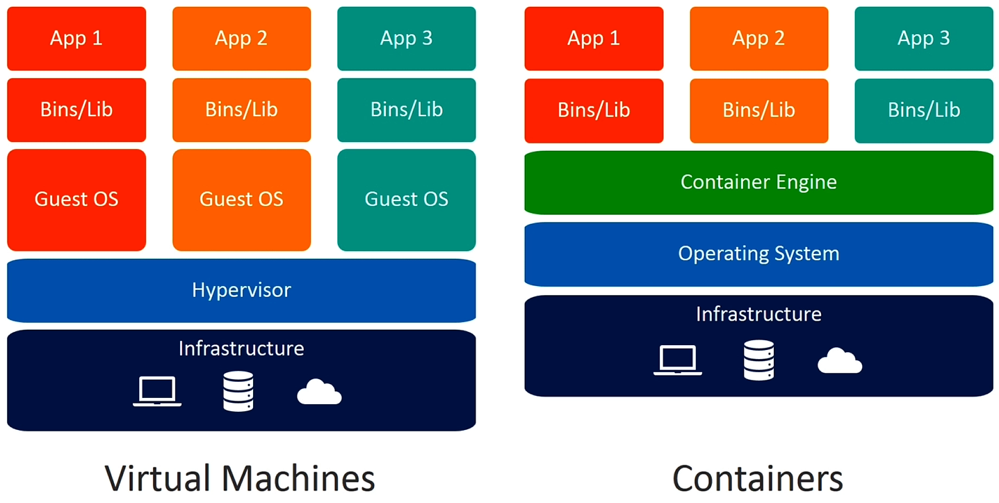
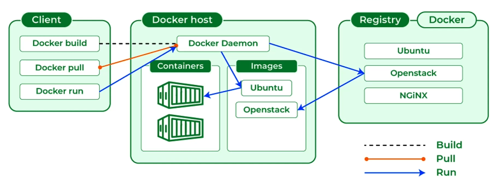

# Curso Docker - Notas y Ejemplos

Este repositorio contiene notas, ejemplos y archivos de configuración utilizados durante el [Curso Profesional de Docker de Código Facilito](https://codigofacilito.com/cursos/docker). El objetivo es documentar conceptos clave, comandos útiles y ejemplos prácticos/ejecutables para aprender y repasar Docker, Docker Compose, volúmenes, redes y conceptos básicos de orquestadores como Kubernetes.

## Ejemplos visuales




## Estructura del repositorio

- `.env`: Archivo de variables de entorno (ignorado por git).
- `Dockerfile_2VariablesEntornoArgumentosRun`: Ejemplo de Dockerfile básico con Variables de entorno, argumentos y run.
- `dockerfile_3Volumenes_Redes`: Notas y ejemplos sobre el uso de volúmenes y redes en Docker.
- `dockerfile_4Imágenes`: Ejemplos y explicación sobre la creación de imágenes personalizadas con Dockerfile.
- `docker-compose_5.yml`: Ejemplo de archivo Docker Compose con múltiples servicios, redes y volúmenes.
- `dockerfile_8introK8s`: Introducción básica a Kubernetes y orquestadores de contenedores.
- `volumen/`: Carpeta utilizada como volumen para persistencia de datos (ignorada por git).

Puedes ejecutar todos los dockerfile editando su nombre quitando el "\_" y lo que hay a la derecha de este (es decir, quedando así "dockerfile" 🙂) el archivo 5 (compose) debería correr sin problemas

## Temas cubiertos

- Conceptos básicos de Docker y contenedores.
- Uso de Docker Compose para definir aplicaciones multicontenedor.
- Montaje y gestión de volúmenes para persistencia de datos.
- Configuración de redes personalizadas en Docker.
- Creación de imágenes personalizadas con Dockerfile.
- Introducción a orquestadores como Kubernetes.
- Comandos útiles de Docker y Docker Compose.

## Uso

Este repositorio es público y puede ser utilizado por cualquier persona interesada en aprender Docker. Puedes clonar el repositorio y adaptar los ejemplos a tus necesidades.

```sh
git clone https://github.com/p4v0/CursoProfesionalDocker
```

> **Nota:** Los archivos y ejemplos están pensados para fines educativos y pueden requerir adaptación según tu entorno.

## Licencia

Este repositorio se comparte bajo licencia MIT. Si te resulta útil, siéntete libre de compartirlo y contribuir.

Sólo asegúrate de agredecer al autor original :smile: [@p4v0](https://github.com/p4v0)

---

¡Espero que estas notas te sean útiles en tu aprendizaje de Docker!
